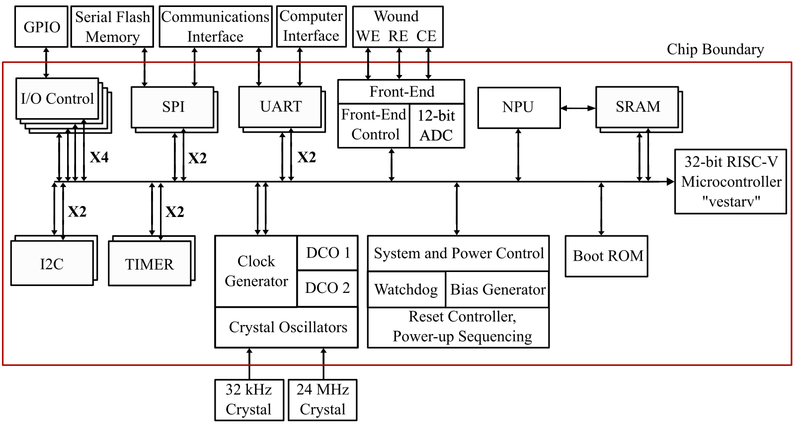

# VestaRV32 - A Custom RISC-V Core & SoC

 

VestaRV is a custom 32-bit RISC-V processor core designed as an independent personal project, built from the ground up using the official RISC-V instruction set specification without deriving from any existing core implementations. This repository not only provides the VestaRV core but also a full MCU System on Chip (SoC) that surrounds the core, enabling rapid integration into embedded and SoC designs. 

**Namesake:**  
VestaRV is named after **Vesta**, the Roman goddess of hearth, home, and the eternal flame. As Vesta’s fire symbolized the heart of the household, VestaRV is designed to be the heart of your embedded system—providing reliability and a strong foundation for your MCU and SoC projects.

## MCU Block Diagram

Below is the MCU-level block diagram showing VestaRV instantiated within the MCU and the major peripherals highlighted:

## Table of Contents

- [Features and Typical Applications](#features-and-typical-applications)
- [Files in this Repository](#files-in-this-repository)
- [Core Specifications](#core-specifications)
- [MCU Peripherals](#mcu-peripherals)
- [Memory Architecture](#memory-architecture)
- [Interrupt Handling](#interrupt-handling)
- [Building and Toolchain](#building-and-toolchain)
- [Author and Support](#author-and-support)

---

## Features and Typical Applications

- **Custom RISC-V Core** supporting:
  - RV32I Base ISA
  - 'M' Extension (Integer multiplication & division)
  - 'C' Extension (Compressed instructions)
  - 'A' Extension (Atomic Memory Operations)
  - 'ZBA', 'ZBB', 'ZBC', 'ZBS' (Advanced Bit Manipulation)
  - 'ZICNTR' (Partial, e.g., RDCYCLE and RDINSTRET)
- **Stack-based interrupt handling** 
- **Post Innovus verification**
- **Full MCU System on Chip Implementation** 
- Designed for easy integration into ASICs

Typical applications include:
- Custom embedded MCU development
- Mixed signal and sensor interfacing

---

## Files in this Repository

- `README.md`  
  _This file. Overview, documentation, and usage instructions._
- HDL sources for VestaRV core and MCU peripherals
- Scripts and Makefiles for simulation and synthesis
- Testbenches 

**Directory Highlights:**
- `hdl/` — VestaRV core and MCU HDL sources
- `genus/` — Logic Synthesis
- `innovus/` — Physical Implementation
- `riscv-tests/` — Instruction-level, peripheral, and boot validation tests. Adapted from: https://github.com/riscv-software-src/riscv-tests

---

## Core Specifications

- **ISA:** RV32I Base + M, C, A, ZBA, ZBB, ZBC, ZBS, ZICNTR (partial)
- **Interrupts:** Stack-based - recursive
- **Verification:** Post-physical verified
- **Extensions:** Bit manipulation, atomic ops, compressed, and multiply/divide instructions

---

## MCU Peripherals - Configurable

- **System**
  - Clock Multiplexing/Dividing
  - 2 × Digitally Controlled Oscillator (DCO)
  - Watchdog Timer (WDT)
  - CRC engine
  - ROM/RAM power gating
- **Compute**  
  - 1 × HW-NN 
- **I/O**
  - 4 × GPIO
  - 1 × SPI
  - 1 × SPI Flash Extended Memory 
  - 2 × UART
  - 2 × Timer

---

## MCU Memory Architecture - Configurable

- **16 KiB ROM**
- **2 × 16 KiB SRAM**

---

## Interrupt Handling

- **Stack-based mechanism** enables recursive interrupt handling
- **Caution:** Recursive interrupts may lead to stack overflow if not managed

---

## Building and Toolchain

Toolchains (gcc, binutils, etc.) can be obtained via the [RISC-V Website](https://riscv.org/software-status/). Example programs expect various RV32 toolchains installed in `/opt/riscv32i[m][c]`. Many Linux distributions now include RISC-V tools (e.g., Ubuntu 20.04 provides `gcc-riscv64-unknown-elf`). Set `TOOLCHAIN_PREFIX` accordingly for your environment (e.g., `make TOOLCHAIN_PREFIX=riscv64-unknown-elf`).

---

## Author and Support

**Author:**  
_Maxx Seminario_    
PhD Student, Integrated Circuit Design  
Analog, Mixed-Signal, and System-on-Chip Design  
University of Nebraska-Lincoln    
Email: mseminario2@huskers.unl.edu  

If you need access, support, or have questions about VestaRV or its MCU subsystem, please reach out directly to the author via email. 

---

## License

VestaRV is released as open hardware under a permissive license (similar to MIT/ISC/BSD). See `LICENSE` for full details.
